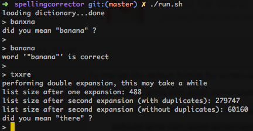

# Spellingcorrector
Spelling corrector in Erlang. Based on the [Norvig article](http://norvig.com/spell-correct.html), uses detached Erlang process for correction. Requests for correction are done via message passing.
Word frequency list taken from [wiktionary.org](http://en.wiktionary.org/wiki/Wiktionary:Frequency_lists)

##Usage

##TODO
 * space-optimize second expansion
 * implement character replacement based on [soundex](http://http://en.wikipedia.org/wiki/Soundex) and QUERY keyboard key distance
